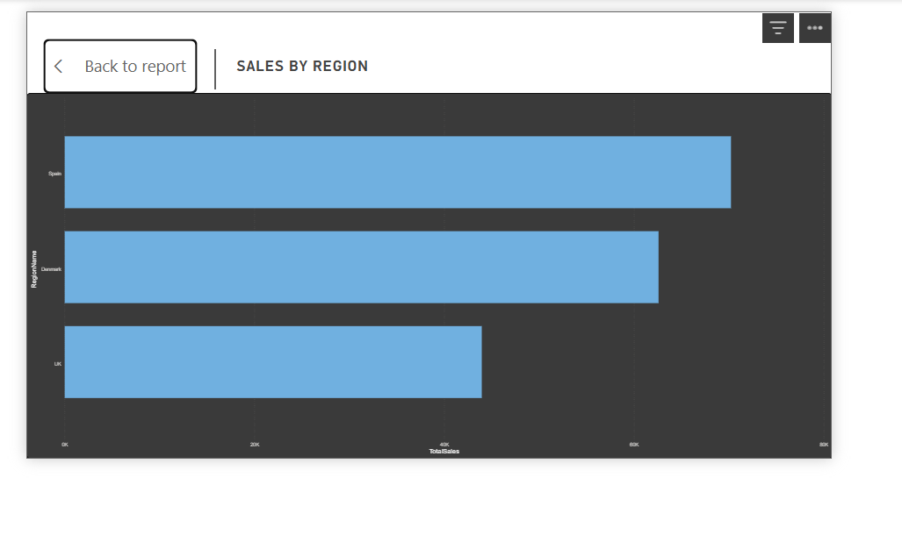
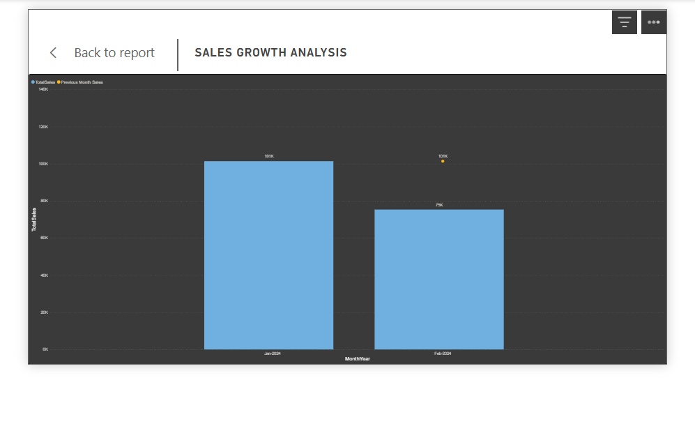
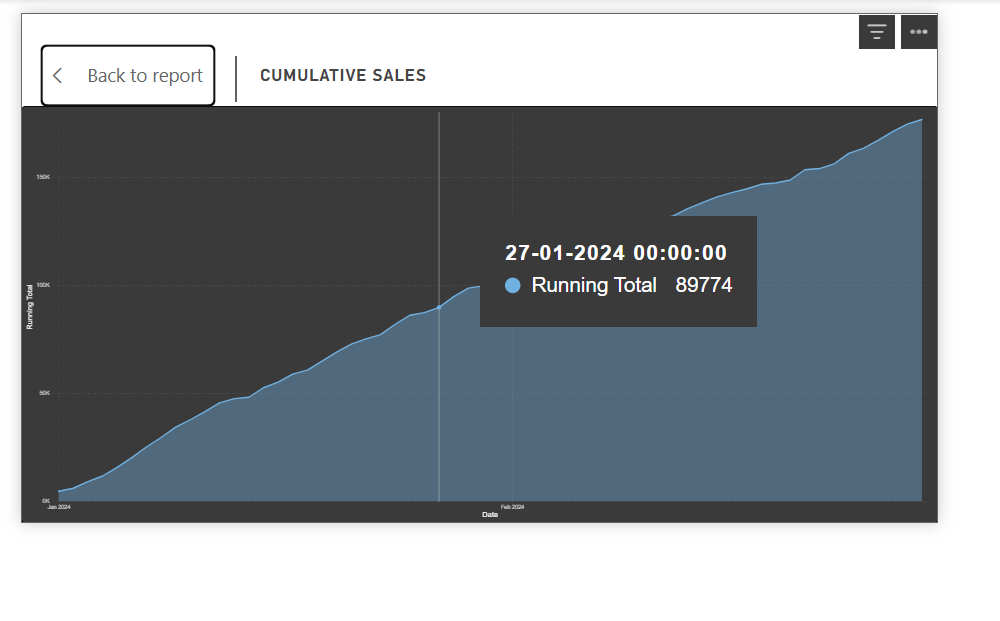

# 📊 Sales Performance Dashboard

An interactive **Power BI dashboard** built to analyze sales performance across different regions, products, and customer segments. This project transforms raw sales data into meaningful business insights using **Power BI, DAX, Power Query, and Data Modeling**.

---

## 🚀 Project Overview

This dashboard enables users to monitor key sales metrics, compare regional performance, identify sales trends, and make data-driven decisions through interactive visualizations.

---

## ✨ Key Features

- 📈 Interactive KPI Cards (Sales, Profit, Orders, Customers)
- 🌍 Regional Sales Analysis
- 📊 Sales Growth Analysis
- 📅 Cumulative Sales Trend
- 🛍️ Product Performance Analysis
- 🎯 Interactive Filters & Slicers
- ⚡ DAX Measures & Calculations
- 🔄 Data Cleaning using Power Query

---

## 🛠️ Tools & Technologies

- **Power BI Desktop**
- **Power Query**
- **DAX**
- **Data Modeling**
- **Microsoft Excel**

---

# 📷 Dashboard Preview

## 1️⃣ Dashboard Overview


---

## 2️⃣ Sales by Region



---

## 3️⃣ Sales Growth Analysis



---

## 4️⃣ Cumulative Sales



---

# 📈 Key Business Insights

- Spain recorded the highest sales among all regions.
- Security products generated the highest revenue.
- Profit margin reached approximately **20%**.
- The dashboard provides dynamic filtering by:
  - Region
  - Segment
  - Channel
  - Month
- Interactive visuals help identify sales trends and support business decision-making.

---

# 📂 Repository Structure

```
Sales-Performance-Dashboard/
│── README.md
│── 01-Sales_Performance_Dashboard.pbix
│── 02-Dashboard- Overview.png
│── 03-salesbyregion.png
│── 04-salesgrowthanalysis.png
│── 05-CummulativeSales.png
```

---

# 💡 Skills Demonstrated

- Data Cleaning
- Data Transformation
- Data Modeling
- DAX Calculations
- Dashboard Design
- Business Intelligence
- Data Visualization
- KPI Development
- Business Analytics

---

# 👨‍💻 Author

**Rohan Kumar Thakur**

GitHub: https://github.com/rohanthakurtwt

---

⭐ If you found this project useful, feel free to star the repository.
